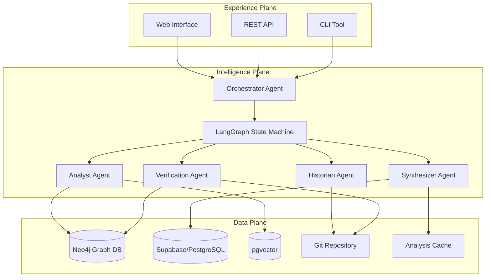

# Design Document

## Overview

The Multi-Agent Code Intelligence System is architected as a three-layer platform: the Data Plane (knowledge backbone), the Intelligence Plane (AI orchestration), and the Experience Plane (user interfaces). The system processes Git repositories into temporal Code Property Graphs, orchestrates specialized AI agents through LangGraph workflows, and provides verified insights through multiple interfaces. The architecture emphasizes parallel processing, verification-first design, and scalable multi-agent coordination.

## Architecture

### High-Level System Architecture



### Data Plane Architecture

The Data Plane serves as the knowledge backbone using a hybrid database architecture optimized for different data access patterns:

**Primary Graph Database: Neo4j**
- **Temporal Code Property Graph (CPG)**: Native graph storage of code elements, relationships, and version history
- **Deep Relationship Traversal**: Optimized for multi-hop queries like dependency tracing and impact analysis
- **Index-Free Adjacency**: Enables orders-of-magnitude faster graph traversals compared to relational JOINs
- **Temporal Modeling**: Version history through commit-linked nodes providing historical code analysis

**Secondary Relational Database: Supabase/PostgreSQL**
- **User Management**: Authentication, project configurations, and user preferences
- **Metadata Storage**: Repository information, analysis job status, and system configuration
- **Analysis Cache**: Cached results from previous agent analyses for performance optimization
- **Billing and Usage**: Subscription management and usage tracking

**Vector Storage: pgvector Extension**
- **Code Embeddings**: Vector representations of functions, classes, and code blocks
- **Semantic Search Index**: Optimized for conceptual code discovery
- **Cross-Reference Mappings**: Links between vector embeddings and graph entities

**Git Integration Layer**
- **Repository Cloning**: Automated git repository management
- **History Traversal**: Efficient commit history processing using libgit2-style operations
- **Diff Analysis**: Structural and semantic difference computation

### Intelligence Plane Architecture

The Intelligence Plane orchestrates AI agents through a sophisticated state machine:

**LangGraph State Machine**
- **Centralized State Management**: Shared state object passed between all agents
- **Conditional Routing**: Dynamic workflow paths based on query complexity and agent results
- **Error Handling**: Graceful degradation and recovery mechanisms
- **Progress Tracking**: Real-time execution monitoring and user feedback

**Agent Specialization Strategy**
- **Orchestrator Agent**: Query parsing, workflow initiation, and result synthesis
- **Historian Agent**: Git history analysis and temporal data extraction
- **Analyst Agent**: Deep code analysis using graph queries and semantic search
- **Synthesizer Agent**: Multi-source result compilation and narrative generation
- **Verification Agent**: Independent validation of all findings against source data

## Components and Interfaces

### Core Agent Components

#### Orchestrator Agent
**Purpose**: Central coordination and query interpretation
**Inputs**: Natural language queries, user context
**Outputs**: Parsed query structure, workflow initialization
**Tools**: 
- Query parser (LLM-based)
- Workflow router
- State initializer

#### Historian Agent
**Purpose**: Git history analysis and temporal data extraction
**Inputs**: Repository path, target code elements, time ranges
**Outputs**: Commit sequences, change timelines, developer metadata
**Tools**:
- Git command interface
- Commit message analyzer
- Temporal relationship mapper

#### Analyst Agent
**Purpose**: Deep structural and semantic code analysis
**Inputs**: Code elements, version pairs, analysis scope
**Outputs**: Structural changes, dependency impacts, semantic insights
**Tools**:
- Neo4j/Cypher query interface
- Vector similarity search
- AST comparison engine
- Dependency tracer

#### Synthesizer Agent
**Purpose**: Multi-source result compilation and narrative generation
**Inputs**: Raw findings from multiple agents, user query context
**Outputs**: Coherent analysis reports, structured insights
**Tools**:
- Report template engine
- Citation formatter
- Narrative generator (LLM-based)

#### Verification Agent
**Purpose**: Independent validation of all findings
**Inputs**: Agent claims, source code references, git data
**Outputs**: Confidence scores, validation results, uncertainty flags
**Tools**:
- Source code validator
- Git reference checker
- Consistency analyzer

### Data Models

#### Code Property Graph Model (Neo4j)

The temporal Code Property Graph is modeled as a native graph in Neo4j, optimized for deep relationship traversals and code analysis queries.

**Node Types**:
- **:Function** - Individual functions with properties like `name`, `file_path`, `start_line`, `end_line`, `signature_hash`
- **:Class** - Class definitions with properties like `name`, `file_path`, `inheritance_chain`
- **:File** - Source files with properties like `path`, `language`, `size`, `last_modified`
- **:Commit** - Git commits with properties like `sha`, `message`, `author`, `timestamp`
- **:Repository** - Repository metadata with properties like `name`, `url`, `analysis_status`

**Relationship Types**:
- **CALLS** - Function call relationships (e.g., `functionA -[:CALLS]-> functionB`)
- **IMPORTS** - Module import dependencies (e.g., `fileA -[:IMPORTS]-> moduleB`)
- **CONTAINS** - Hierarchical containment (e.g., `class -[:CONTAINS]-> method`)
- **CHILD_OF** - AST parent-child relationships for syntax tree navigation
- **CHANGED_IN** - Temporal relationships linking code elements to commits
- **DEPENDS_ON** - Data and control dependencies between code elements

**Temporal Modeling**:
Version history is captured by linking code element nodes to `:Commit` nodes through `CHANGED_IN` relationships. This creates a temporal dimension where agents can query the state of any code element at any point in the repository's history. Each code element maintains properties that track its evolution, while the graph structure preserves the complete historical context.

**Query Optimization**:
The graph model enables efficient traversal queries such as "find all functions transitively called by X" or "trace the impact of changes in commit Y across the dependency graph" without expensive JOIN operations, leveraging Neo4j's index-free adjacency for optimal performance.

#### Agent State Schema

```typescript
interface AgentState {
  query: {
    original: string;
    parsed: ParsedQuery;
    scope: QueryScope;
  };
  repository: {
    id: string;
    path: string;
    current_commit: string;
  };
  analysis: {
    target_elements: CodeElement[];
    time_range: TimeRange;
    findings: AgentFinding[];
  };
  verification: {
    confidence_scores: Record<string, number>;
    citations: Citation[];
    uncertainties: string[];
  };
  progress: {
    current_agent: string;
    completed_steps: string[];
    estimated_remaining: number;
  };
}
```

### Interface Specifications

#### REST API Endpoints

```typescript
// Query submission
POST /api/v1/queries
{
  repository_url: string;
  query: string;
  options?: {
    max_commits?: number;
    languages?: string[];
    include_tests?: boolean;
  }
}

// Query status and results
GET /api/v1/queries/{query_id}
Response: {
  status: 'pending' | 'processing' | 'completed' | 'failed';
  progress: number;
  current_agent?: string;
  results?: AnalysisResult;
  error?: string;
}

// Repository management
POST /api/v1/repositories
{
  url: string;
  name?: string;
  auto_sync?: boolean;
}

GET /api/v1/repositories/{repo_id}/status
Response: {
  analysis_status: string;
  last_analyzed: string;
  commit_count: number;
  supported_languages: string[];
}
```

#### WebSocket Events for Real-time Updates

```typescript
// Client subscribes to query progress
subscribe: {
  type: 'query_progress';
  query_id: string;
}

// Server sends progress updates
progress_update: {
  query_id: string;
  current_agent: string;
  progress_percentage: number;
  current_step: string;
  estimated_completion: string;
}

// Server sends intermediate results
partial_results: {
  query_id: string;
  agent: string;
  findings: AgentFinding[];
  confidence: number;
}
```

## Error Handling

### Agent Failure Recovery

**Graceful Degradation Strategy**:
1. **Agent Timeout Handling**: If any agent exceeds timeout thresholds, the orchestrator continues with available results
2. **Partial Result Synthesis**: The synthesizer can generate meaningful reports even with incomplete agent data
3. **Confidence Adjustment**: Missing agent data automatically reduces confidence scores with clear explanations
4. **Retry Logic**: Failed agents are retried once with reduced scope before graceful degradation

**Error Classification**:
- **Recoverable Errors**: Network timeouts, temporary database unavailability, rate limits
- **Data Errors**: Corrupted git history, unparseable code, missing dependencies
- **Logic Errors**: Agent reasoning failures, inconsistent findings, verification failures

### Verification Failure Handling

**Multi-Level Verification**:
1. **Source Validation**: All file paths, line numbers, and commit SHAs are verified against actual repository data
2. **Consistency Checking**: Agent findings are cross-validated for logical consistency
3. **Confidence Thresholding**: Results below 90% confidence are flagged with uncertainty indicators
4. **Human Escalation**: Complex verification failures are flagged for human review

## Testing Strategy

### Multi-Agent Integration Testing

**Agent Coordination Tests**:
- **State Consistency**: Verify shared state remains consistent across agent transitions
- **Workflow Completeness**: Ensure all agent workflows complete successfully for various query types
- **Error Propagation**: Test error handling and recovery across agent boundaries
- **Performance Under Load**: Validate system behavior with concurrent multi-agent workflows

**End-to-End Scenario Testing**:
- **Code Evolution Analysis**: Complete workflows for tracing function changes across versions
- **Regression Debugging**: Full analysis pipelines for identifying breaking changes
- **Semantic Search Integration**: Combined vector search and graph analysis workflows
- **Verification Accuracy**: Validation of verification agent accuracy against known ground truth

### Data Integrity Testing

**Temporal Graph Validation**:
- **Version Consistency**: Ensure temporal relationships accurately reflect git history
- **Relationship Integrity**: Validate code relationships (calls, imports, dependencies) across versions
- **Embedding Quality**: Test semantic search accuracy and relevance
- **Cache Coherence**: Verify cached results remain valid across repository updates

### Performance and Scalability Testing

**Repository Scale Testing**:
- **Large Repository Handling**: Test with repositories containing 50k+ lines of code
- **Deep History Analysis**: Validate performance with 1000+ commit histories
- **Concurrent Query Processing**: Test system behavior with multiple simultaneous queries
- **Memory and Resource Management**: Ensure efficient resource utilization under load

**Agent Performance Profiling**:
- **Individual Agent Benchmarks**: Measure performance of each agent type
- **Workflow Optimization**: Identify and optimize bottlenecks in agent coordination
- **Database Query Performance**: Optimize graph queries and vector searches
- **Caching Effectiveness**: Measure cache hit rates and performance improvements